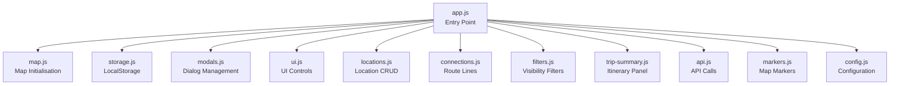
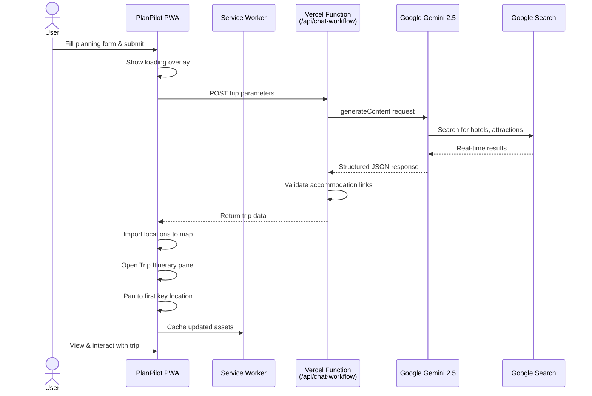
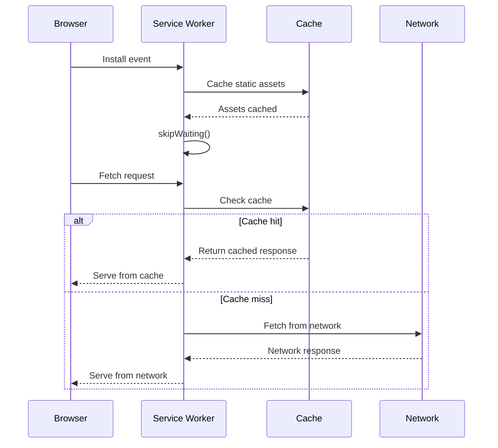
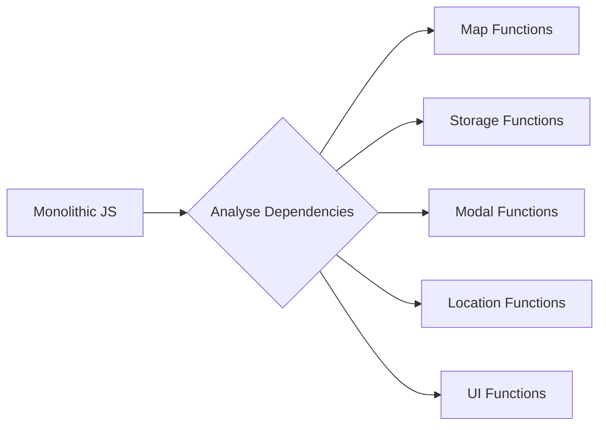

# PlanPilot v1.0: Trip Itinerary Redesign & Progressive Web App

**Release Date:** 30th November 2025  
**Version:** 1.0  
**Status:** Production-ready  
**Live Demo:** [plan-pilot-one.vercel.app](https://plan-pilot-one.vercel.app)

---

## Executive Summary

Today marks a significant milestone for PlanPilot—the release of version 1.0. Building upon the foundational Gemini AI integration delivered in v0.1, this release introduces a completely redesigned Trip Itinerary interface, Progressive Web App (PWA) capabilities, and numerous user experience enhancements. The application now functions as an installable, offline-capable travel planning tool with a polished, card-based interface for managing trip destinations.

This release represents 39 commits since v0.1, encompassing a substantial refactoring of the frontend architecture, introduction of modular JavaScript components, and implementation of modern web platform features. The result is a more intuitive, responsive, and capable trip planning application.

---

## Table of Contents

- [Background & Motivation](#background--motivation)
- [Technical Architecture](#technical-architecture)
- [Major Features Delivered](#major-features-delivered)
- [Implementation Deep Dive](#implementation-deep-dive)
- [Challenges & Solutions](#challenges--solutions)
- [What I Learnt](#what-i-learnt)
- [Future Roadmap](#future-roadmap)
- [Technical Tags](#technical-tags)

---

## Background & Motivation

### Building on v0.1

Version 0.1 established the core AI-powered trip generation capability, migrating from OpenAI to Google Gemini with search grounding. Whilst the backend was robust, the frontend experience needed refinement. Users could generate trips, but managing and visualising them was cumbersome.

### User Experience Gaps

After releasing v0.1, several pain points became apparent:

**Interface Limitations**
- The timeline feature was visually complex but difficult to interact with
- Trip locations were displayed in a flat list without hierarchical context
- Mobile users struggled with horizontal scrolling timelines
- No way to install the app for quick access

**Editing Workflow**
- Adding or removing locations required navigating through multiple controls
- Reordering locations wasn't intuitive
- The relationship between key locations and their nearby attractions/accommodations wasn't clear

**Offline Access**
- Users couldn't access their saved trips without an internet connection
- No way to install the app to the home screen
- Every visit required loading all resources from the network

### The v1.0 Vision

The goals for v1.0 were clear:

✅ **Redesigned Trip Itinerary** - Card-based, hierarchical layout showing key locations with nested accommodations and attractions  
✅ **Progressive Web App** - Installable, offline-capable, native app-like experience  
✅ **Improved Editing** - Drag-and-drop reordering, inline deletion, smart map panning  
✅ **Modular Architecture** - Refactored JavaScript into focused, maintainable modules  
✅ **Enhanced Mobile Experience** - Touch-friendly interactions, responsive design improvements

---

## Technical Architecture

### System Overview

PlanPilot v1.0 maintains its serverless architecture whilst introducing significant frontend enhancements:

**Frontend:**
- Vanilla JavaScript (ES6+ modules)
- Leaflet.js for interactive maps
- OpenStreetMap tiles with multiple style options
- Browser LocalStorage for persistence
- Service Worker for offline caching

**Backend:**
- Vercel Serverless Functions (Node.js)
- Google Gemini 2.5 API with search grounding
- JSON-based data exchange

**PWA Features:**
- Web App Manifest for installation
- Service Worker for offline access
- Cache-first strategy for static assets

### Modular JavaScript Architecture

The frontend was refactored from a monolithic structure into focused modules:



**Module Responsibilities:**

| Module | Purpose | Lines |
|--------|---------|-------|
| `app.js` | Application state, initialisation, global exports | 645 |
| `trip-summary.js` | Card-based itinerary panel, drag-and-drop | 1,106 |
| `modals.js` | Confirm, alert, import, planning dialogs | 256 |
| `locations.js` | Add, delete, update location operations | ~200 |
| `map.js` | Leaflet map setup, style switching | ~180 |
| `filters.js` | Location type visibility controls | ~120 |
| `storage.js` | LocalStorage read/write operations | ~80 |
| `api.js` | Trip generation API calls | 84 |

### Request Flow for Trip Generation



---

## Major Features Delivered

### 1. Redesigned Trip Itinerary Panel

**Implementation Date:** 24th-30th November 2025

The centrepiece of v1.0—a completely reimagined trip summary interface using a card-based layout.

**Key Features:**

- **Card-Based Layout** - Each key location displayed as an expandable card
- **Hierarchical Structure** - Accommodations and attractions nested under their nearest key location
- **Smart Association** - Items automatically associated with the nearest key location using Haversine distance calculation
- **Expandable Details** - Click to reveal nearby places with prices and booking links
- **Drag-and-Drop Reordering** - Reorder both key locations and nested items
- **Inline Deletion** - Delete buttons on cards and nested items
- **Statistics Dashboard** - At-a-glance view of stops, days, stays, and sights

**Visual Design:**

```
┌─────────────────────────────────────────────────┐
│ 🗺️ Trip Itinerary                    [+][🗑️][✕] │
├─────────────────────────────────────────────────┤
│ ┌─────┬─────┬─────┬─────┐                       │
│ │  3  │ 10  │  4  │  8  │  ← Statistics         │
│ │Stops│Days │Stays│Sights│                      │
│ └─────┴─────┴─────┴─────┘                       │
│                                                 │
│ ┌─ Card 1 ────────────────────────────────────┐ │
│ │ [1] Paris                          [🔍][🗑️] │ │
│ │     City of Light, main destination         │ │
│ │     5 days                                  │ │
│ │ ┌─ View 5 nearby places ─────────────── ▼ ┐ │ │
│ │ │ 🏨 Accommodations                       │ │ │
│ │ │   ├─ Hotel Atmospheres    €185/night    │ │ │
│ │ │   └─ Le Marais Boutique   €220/night    │ │ │
│ │ │ ⭐ Attractions                           │ │ │
│ │ │   ├─ Eiffel Tower         €26           │ │ │
│ │ │   ├─ Louvre Museum        €17           │ │ │
│ │ │   └─ Sacré-Cœur           Free          │ │ │
│ │ └─────────────────────────────────────────┘ │ │
│ └─────────────────────────────────────────────┘ │
│                                                 │
│ ┌─ Card 2 ────────────────────────────────────┐ │
│ │ [2] Versailles                     [🔍][🗑️] │ │
│ │     Day trip destination                    │ │
│ │     1 day                                   │ │
│ │ ┌─ View 2 nearby places ─────────────── ▼ ┐ │ │
│ └─────────────────────────────────────────────┘ │
└─────────────────────────────────────────────────┘
```

**Technical Implementation:**

The association algorithm uses geodesic distance to link accommodations and attractions to their nearest key location:

```javascript
export function getAssociatedItems(baseLocation, locations) {
    const keyLocations = locations.filter(loc => loc.type === 'key-location');
    
    const associatedItems = locations.filter(item => {
        if (item.id === baseLocation.id || item.type === 'key-location') return false;
        if (item.type !== 'accommodation' && item.type !== 'attraction') return false;

        // Find the nearest key location to this item
        let nearestKeyLocation = null;
        let nearestDistance = Infinity;
        
        for (const keyLoc of keyLocations) {
            const distance = getDistance(keyLoc.lat, keyLoc.lng, item.lat, item.lng);
            if (distance < nearestDistance) {
                nearestDistance = distance;
                nearestKeyLocation = keyLoc;
            }
        }
        
        // Only associate if baseLocation is the nearest
        return nearestKeyLocation && nearestKeyLocation.id === baseLocation.id;
    });

    return {
        accommodations: associatedItems.filter(item => item.type === 'accommodation'),
        attractions: associatedItems.filter(item => item.type === 'attraction')
    };
}
```

### 2. Progressive Web App (PWA) Implementation

**Implementation Date:** 27th November 2025

PlanPilot now functions as a fully installable Progressive Web App with offline capabilities.

**PWA Components:**

**Web App Manifest (`manifest.json`):**
```json
{
  "name": "PlanPilot - Trip Planner",
  "short_name": "PlanPilot",
  "description": "Plan your perfect getaway with AI-powered trip planning",
  "start_url": "/",
  "display": "standalone",
  "background_color": "#1E88E5",
  "theme_color": "#1E88E5",
  "orientation": "portrait-primary",
  "icons": [
    {
      "src": "/planpilot.png",
      "sizes": "192x192",
      "type": "image/png",
      "purpose": "any maskable"
    }
  ],
  "categories": ["travel", "navigation", "productivity"]
}
```

**Service Worker (`service-worker.js`):**



**Cached Resources:**
- All HTML, CSS, and JavaScript files
- Application logo and icons
- Manifest file
- Leaflet library (via CDN, network-first)

**Installation Experience:**

Users can install PlanPilot to their home screen on both iOS and Android:

| Platform | Method | Result |
|----------|--------|--------|
| iOS (Safari) | Share → Add to Home Screen | Full-screen standalone app |
| Android (Chrome) | Menu → Install app | Native-like PWA |
| Desktop (Chrome) | Install icon in address bar | Desktop application |

### 3. Smart Map Panning

**Implementation Date:** 29th November 2025

When clicking on locations in the Trip Itinerary panel, the map now intelligently pans to ensure the marker is visible and not obscured by the panel.

**The Challenge:**

The Trip Itinerary panel floats over the map. When clicking a location, simply centering the map on that location could place the marker directly under the panel, making it invisible.

**The Solution:**

Smart panning calculates the visible area of the map and offsets the pan target accordingly:

```javascript
function panToLocationSmart(lat, lng, zoom = 12) {
    const map = getMap();
    const container = document.getElementById('trip-summary-container');
    const isVisible = container && container.classList.contains('visible');
    
    if (!isVisible) {
        map.setView([lat, lng], zoom, { animate: true });
        return;
    }
    
    // Get map and panel dimensions
    const mapRect = map.getContainer().getBoundingClientRect();
    const panelRect = container.getBoundingClientRect();
    
    // Calculate offset based on available space
    const leftSpace = panelRect.left - mapRect.left;
    const rightSpace = mapRect.right - panelRect.right;
    
    let offsetX = 0;
    if (leftSpace > rightSpace) {
        offsetX = -(panelRect.width / 2 + leftSpace / 2) * 0.5;
    } else {
        offsetX = (panelRect.width / 2 + rightSpace / 2) * 0.5;
    }
    
    // Apply offset to target coordinates
    const targetPoint = map.project([lat, lng], zoom);
    targetPoint.x += offsetX;
    const targetLatLng = map.unproject(targetPoint, zoom);
    
    map.setView(targetLatLng, zoom, { animate: true });
}
```

### 4. Drag-and-Drop Reordering

**Implementation Date:** 26th-28th November 2025

Both key location cards and nested items (accommodations/attractions) support drag-and-drop reordering.

**Implementation Details:**

- **Visual Feedback** - Dragged items show elevation and opacity changes
- **Drop Indicators** - Clear visual cues for drop targets
- **Separate Contexts** - Key locations reorder among themselves; nested items reorder within their section
- **Automatic Save** - Changes persist to LocalStorage immediately
- **Order Preservation** - Order numbers update in the data model

```javascript
// Card drag handlers
card.addEventListener('dragstart', handleCardDragStart);
card.addEventListener('dragover', handleCardDragOver);
card.addEventListener('drop', handleCardDrop);
card.addEventListener('dragend', handleCardDragEnd);

// Nested item drag handlers (with event.stopPropagation() to prevent card drag)
itemEl.addEventListener('dragstart', (e) => handleNearbyItemDragStart(e, type, keyLocationId));
itemEl.addEventListener('dragover', handleNearbyItemDragOver);
itemEl.addEventListener('drop', handleNearbyItemDrop);
itemEl.addEventListener('dragend', handleNearbyItemDragEnd);
```

### 5. Enhanced Delete Mode

**Implementation Date:** 27th November 2025

A dedicated delete mode allows users to remove multiple locations efficiently.

**Features:**
- **Toggle Button** - Activates/deactivates delete mode
- **Visual Indicators** - Red highlighting on deletable items
- **Confirmation Dialogs** - Prevents accidental deletions
- **Cascade Handling** - Deleting a key location prompts about associated items

### 6. Draggable Panel

**Implementation Date:** 28th November 2025

The Trip Itinerary panel can be repositioned anywhere on the screen.

**Implementation:**
- **Mouse and Touch Support** - Works on desktop and mobile
- **Viewport Constraints** - Panel stays within visible area
- **Reset on Close** - Returns to default position when closed
- **Cursor Feedback** - Grab cursor on header indicates draggability

```javascript
function updatePanelPosition(clientX, clientY, container) {
    let newX = clientX - panelDragOffset.x;
    let newY = clientY - panelDragOffset.y;
    
    // Constrain to viewport
    const padding = 10;
    newX = Math.max(padding, Math.min(newX, viewportWidth - containerWidth - padding));
    newY = Math.max(padding, Math.min(newY, viewportHeight - containerHeight - padding));
    
    container.style.left = `${newX}px`;
    container.style.top = `${newY}px`;
    container.style.transform = 'none';
    container.classList.add('repositioned');
}
```

### 7. Trip Sharing via Web Share API

**Implementation Date:** 26th November 2025

Users can share their trip plans directly using the device's native share functionality.

**Implementation:**

```javascript
async function handleShareTrip() {
    if (!navigator.share || !navigator.canShare) {
        showAlert('Sharing is not supported on this browser.');
        return;
    }
    
    const data = {
        title: state.tripTitle,
        locations: state.locations,
        connections: state.connections,
        exportDate: new Date().toISOString()
    };
    
    const filename = state.tripTitle.replace(/[^a-z0-9]/gi, '_').toLowerCase() + '.trip';
    const blob = new Blob([JSON.stringify(data, null, 2)], { type: 'application/json' });
    const file = new File([blob], filename, { type: 'application/json' });
    
    await navigator.share({
        title: state.tripTitle || 'PlanPilot Trip',
        text: 'Check out my trip plan!',
        files: [file]
    });
}
```

### 8. Map Controls Enhancement

**Implementation Date:** 25th November 2025

Expanded map style options with a cleaner control panel:

**Available Styles:**
- ☀️ Light (CartoDB Positron)
- 🗺️ Street (OpenStreetMap)
- 🛰️ Satellite (Esri World Imagery)
- ⛰️ Topographic (OpenTopoMap)
- 🌙 Dark (CartoDB Dark Matter)

**Filter Controls:**
- Toggle visibility of key locations, accommodations, and attractions
- Live count badges showing number of each type
- Checkbox state persists across sessions

---

## Implementation Deep Dive

### Modular Refactoring Journey

The original `index.html` contained over 4,000 lines of embedded JavaScript. Refactoring this into modules required careful planning:

**Phase 1: Identify Dependencies**



**Phase 2: Extract Modules**

Each module was extracted with explicit imports and exports:

```javascript
// Before: Global functions
function showAlert(message) { /* ... */ }
function saveData(data) { /* ... */ }

// After: ES6 modules
// modals.js
export function showAlert(message, title = 'Information') { /* ... */ }

// storage.js
export function saveData(data) { /* ... */ }
```

**Phase 3: Resolve Circular Dependencies**

Some functions needed access to state from `app.js` whilst being called from other modules. This was resolved using callback patterns:

```javascript
// Instead of importing state directly
export function updateTripSummary(
    locations,           // Passed in
    tripData,            // Passed in
    deleteCallback,      // Callback to app.js
    saveCallback,        // Callback to app.js
    updateListCallback,  // Callback to app.js
    markers              // Passed in
) { /* ... */ }
```

### Service Worker Implementation

The service worker uses a cache-first strategy for static assets:

```javascript
const CACHE_NAME = 'planpilot-v1';
const urlsToCache = [
  '/',
  '/index.html',
  '/css/main.css',
  '/css/components.css',
  '/css/map.css',
  '/css/responsive.css',
  '/js/app.js',
  '/js/api.js',
  // ... all JS modules
  '/planpilot.png',
  '/manifest.json'
];

self.addEventListener('fetch', (event) => {
  event.respondWith(
    caches.match(event.request)
      .then((response) => {
        return response || fetch(event.request);
      })
  );
});
```

**Cache Versioning:**

When updates are deployed, the cache name is incremented, and old caches are cleaned up:

```javascript
self.addEventListener('activate', (event) => {
  event.waitUntil(
    caches.keys().then((cacheNames) => {
      return Promise.all(
        cacheNames.map((cache) => {
          if (cache !== CACHE_NAME) {
            return caches.delete(cache);
          }
        })
      );
    })
  );
  self.clients.claim();
});
```

### Card-Based Layout CSS Architecture

The Trip Itinerary panel uses a carefully structured CSS hierarchy:

```css
/* Container */
.trip-summary-container {
    position: fixed;
    top: 80px;
    left: 50%;
    transform: translateX(-50%);
    width: 90%;
    max-width: 500px;
    max-height: calc(100vh - 100px);
    background: white;
    border-radius: 16px;
    box-shadow: 0 8px 32px rgba(0,0,0,0.15);
    z-index: 1000;
}

/* Cards */
.trip-summary-card {
    background: #f8f9fa;
    border-radius: 12px;
    margin-bottom: 12px;
    transition: all 0.2s ease;
}

.trip-summary-card:hover {
    box-shadow: 0 4px 12px rgba(0,0,0,0.1);
}

/* Nested Items */
.trip-summary-nearby-item {
    display: flex;
    align-items: center;
    padding: 8px 12px;
    background: white;
    border-radius: 8px;
    cursor: pointer;
}
```

---

## Challenges & Solutions

### Challenge 1: Module Loading Order

**Problem:** ES6 modules load asynchronously, causing race conditions where some modules tried to access DOM elements before they existed.

**Solution:** Ensured initialisation only occurs after DOM is ready:

```javascript
if (document.readyState === 'loading') {
    document.addEventListener('DOMContentLoaded', init);
} else {
    init();
}
```

### Challenge 2: Drag-and-Drop on Mobile

**Problem:** Touch events don't natively support HTML5 drag-and-drop. Mobile users couldn't reorder items.

**Solution:** Implemented parallel touch event handlers:

```javascript
// Mouse events
header.addEventListener('mousedown', handlePanelDragStart);
document.addEventListener('mousemove', handlePanelDragMove);
document.addEventListener('mouseup', handlePanelDragEnd);

// Touch events
header.addEventListener('touchstart', handlePanelTouchStart, { passive: false });
document.addEventListener('touchmove', handlePanelTouchMove, { passive: false });
document.addEventListener('touchend', handlePanelDragEnd);
```

### Challenge 3: Nested Drag Conflicts

**Problem:** Dragging a nested item (accommodation/attraction) also triggered the parent card's drag behaviour.

**Solution:** Used `event.stopPropagation()` in nested item drag handlers:

```javascript
function handleNearbyItemDragStart(event, type, keyLocationId) {
    event.stopPropagation(); // Prevent card from dragging
    nearbyItemDragging = event.currentTarget;
    // ...
}
```

### Challenge 4: Service Worker Cache Invalidation

**Problem:** After deploying updates, users continued seeing cached versions of the application.

**Solution:** Implemented cache versioning and forced update on activation:

```javascript
const CACHE_NAME = 'planpilot-v1'; // Increment for updates

self.addEventListener('install', (event) => {
    // ...
    self.skipWaiting(); // Activate immediately
});

self.addEventListener('activate', (event) => {
    // Clean old caches
    self.clients.claim(); // Take control immediately
});
```

### Challenge 5: Panel Obscuring Map Markers

**Problem:** When clicking a location in the Trip Itinerary, the map would centre on that location, but the marker might be hidden under the panel.

**Solution:** Implemented smart panning that calculates available space and offsets the target accordingly (detailed in Major Features section).

### Challenge 6: Maintaining State Across Modules

**Problem:** Multiple modules needed access to application state (locations, markers, connections), but passing state through every function call was unwieldy.

**Solution:** Used a callback pattern where `app.js` provides update functions to other modules:

```javascript
function getUpdateCallbacks() {
    return {
        save: saveCurrentState,
        updateList: () => updateLocationsList(state.locations, ...),
        updateFilters: () => updateFilterCounts(state.locations),
        updateTripSummary: () => updateTripSummary(state.locations, ...)
    };
}
```

---

## What I Learnt

### Technical Learnings

#### 1. ES6 Modules in Practice

**Key Insights:**
- Module scope prevents global namespace pollution
- Explicit imports/exports make dependencies clear
- Circular dependencies require careful architecture
- Tree-shaking potential (though not utilised with vanilla JS)

**Lesson:** Start with modules from day one. Refactoring a monolithic codebase is significantly more work than building modular from the start.

#### 2. Progressive Web Apps Are Surprisingly Accessible

**What I Expected:** Complex configuration, difficult debugging, browser inconsistencies.

**Reality:**
- Basic PWA requires only a manifest and service worker
- Chrome DevTools provide excellent debugging
- iOS Safari has quirks but is workable
- The user experience improvement is substantial

**Key PWA Learnings:**
- `display: standalone` removes browser chrome
- `skipWaiting()` and `clients.claim()` ensure immediate updates
- Cache versioning is essential for update management
- Test on real devices—simulators miss edge cases

#### 3. Drag-and-Drop Requires Careful UX

**Challenges Encountered:**
- Visual feedback is crucial—users need to see what they're dragging
- Drop targets must be clearly indicated
- Mobile requires separate touch handling
- Nested draggable elements conflict without proper event handling

**Best Practices Adopted:**
- Add `.dragging` class for visual feedback
- Use `dragover` to reposition elements in real-time
- Always call `event.preventDefault()` in drop handlers
- Use `event.stopPropagation()` for nested draggables

#### 4. CSS Architecture Matters at Scale

**Evolution:**
- Started with single CSS file (main.css)
- Grew unwieldy at 500+ lines
- Split into logical files: main.css, components.css, map.css, responsive.css

**Organisation Strategy:**
```
css/
├── main.css        # Base styles, variables, layout
├── components.css  # Buttons, cards, modals
├── map.css         # Map-specific styles
└── responsive.css  # Media queries
```

#### 5. State Management Without a Framework

**Approach Used:**
- Single state object in `app.js`
- Callbacks passed to modules needing state access
- LocalStorage for persistence
- Manual DOM updates on state changes

**Trade-offs:**
- ✅ No framework overhead
- ✅ Full control over updates
- ❌ More boilerplate for state changes
- ❌ No reactivity—must manually sync DOM

**Lesson:** For applications of this complexity, vanilla JS is manageable. Beyond this, a lightweight framework (Alpine.js, Preact) would provide significant benefits.

### Process Learnings

#### 1. Incremental Refactoring Works

Rather than rewriting everything at once, I extracted one module at a time:
1. Extract storage functions → test
2. Extract modal functions → test
3. Extract map functions → test
4. Continue until complete

**Benefit:** Each step was reversible, and the application remained functional throughout.

#### 2. Git History as Documentation

The 39 commits since v0.1 tell a story:

```
bf303d3 - Implement smart panning for map locations
132a982 - Add PWA features and enhance offline capabilities
e89286f - Update file import/export options
76ce7ae - Redesign trip summary panel with card-based layout
4417cac - Implement drag-and-drop functionality
```

**Lesson:** Meaningful commit messages are invaluable when reviewing changes months later.

#### 3. Mobile Testing Is Non-Negotiable

Issues only discovered on real mobile devices:
- Touch drag behaviour differences
- iOS Safari's handling of `position: fixed`
- Viewport height calculations with address bar
- PWA installation prompts

**Adopted Practice:** Test every significant change on physical iOS and Android devices before committing.

---

## Future Roadmap

### Immediate Priorities (v1.1)

**1. Day-by-Day Itinerary View**
- Expand trip summary to show daily breakdown
- Morning/afternoon/evening time slots
- Meal suggestions integrated into schedule

**2. Budget Tracking**
- Automatic cost summation from location prices
- Category breakdown (accommodation, attractions, food)
- Currency conversion support

**3. Trip Sharing Links**
- Generate shareable URLs for trips
- Read-only view for shared trips
- Optional password protection

### Medium-Term Goals (v1.2-1.5)

**4. User Accounts**
- Save multiple trips to cloud
- Sync across devices
- Trip history and versioning

**5. Collaborative Planning**
- Invite friends to edit trips
- Real-time collaboration
- Comments and voting on locations

**6. Enhanced Offline Mode**
- Download map tiles for offline use
- Queue API requests when offline
- Sync when connection restored

### Long-Term Vision (v2.0+)

**7. Native Mobile Apps**
- React Native or Flutter implementation
- Push notifications
- Background sync

**8. AI Personalisation**
- Learn from user preferences
- Suggest destinations based on history
- Adaptive recommendations

---

## Technical Specifications

### Technology Stack Summary

**Frontend:**
```
- HTML5
- CSS3 (CSS Variables, Flexbox, Grid)
- Vanilla JavaScript (ES6+ Modules)
- Leaflet.js v1.9.4
- OpenStreetMap / CartoDB / Esri tiles
```

**Backend:**
```
- Node.js (Vercel runtime)
- Google Gemini 2.5 API
- Vercel Serverless Functions
- 60-second timeout limit
```

**PWA:**
```
- Web App Manifest (manifest.json)
- Service Worker (service-worker.js)
- Cache-first strategy
- Offline capability
```

**Storage:**
```
- Browser LocalStorage (client-side)
- JSON format
- No database (yet)
```

### Repository Structure

```
planpilot/
├── public/
│   ├── index.html              # Main HTML
│   ├── manifest.json           # PWA manifest
│   ├── service-worker.js       # Offline support
│   ├── planpilot.png           # App icon
│   ├── css/
│   │   ├── main.css            # Base styles
│   │   ├── components.css      # UI components
│   │   ├── map.css             # Map styles
│   │   └── responsive.css      # Media queries
│   └── js/
│       ├── app.js              # Entry point
│       ├── api.js              # API calls
│       ├── config.js           # Configuration
│       ├── connections.js      # Route lines
│       ├── filters.js          # Visibility filters
│       ├── locations.js        # Location CRUD
│       ├── map.js              # Map setup
│       ├── markers.js          # Map markers
│       ├── modals.js           # Dialogs
│       ├── storage.js          # LocalStorage
│       ├── trip-summary.js     # Itinerary panel
│       └── ui.js               # UI controls
├── api/
│   ├── chat-workflow.js        # Serverless function
│   └── README.md               # API docs
├── workflow-config/
│   ├── GEMINI-SETUP.md
│   ├── system-prompt.md
│   └── ...
├── Articles/
│   ├── v0.1-release-gemini-migration.md
│   ├── v0.1-challenges-and-learnings-summary.md
│   └── v1.0-release-trip-itinerary-pwa.md  # This article
├── ADD-TO-HOME-SCREEN.md       # PWA installation guide
├── package.json
├── vercel.json
└── README.md
```

### Browser Support

| Browser | Version | Status |
|---------|---------|--------|
| Chrome | 90+ | ✅ Full support |
| Firefox | 88+ | ✅ Full support |
| Safari | 14+ | ✅ Full support |
| Edge | 90+ | ✅ Full support |
| iOS Safari | 14+ | ✅ PWA support |
| Chrome Android | 90+ | ✅ PWA support |

---

## Conclusion

PlanPilot v1.0 represents a significant evolution from the initial AI-powered trip generation tool. The introduction of a card-based Trip Itinerary interface, Progressive Web App capabilities, and modular JavaScript architecture transforms the application from a proof-of-concept into a polished, production-ready travel planning tool.

### Key Achievements

✅ **Redesigned Trip Itinerary** - Card-based, hierarchical, drag-and-drop enabled  
✅ **Progressive Web App** - Installable, offline-capable, native-like experience  
✅ **Modular Architecture** - 12 focused JavaScript modules  
✅ **Smart Map Panning** - Locations visible even with panel open  
✅ **Enhanced Mobile Experience** - Touch-friendly, responsive design  
✅ **Trip Sharing** - Native share API integration  
✅ **Multiple Map Styles** - 5 tile layer options

### Lessons Learnt

1. **Modular from the start** - Refactoring is harder than building modular
2. **PWAs are accessible** - Basic implementation is straightforward
3. **Mobile testing is essential** - Simulators miss real-world issues
4. **Drag-and-drop needs care** - Nested elements require proper event handling
5. **State management scales** - Callback patterns work for medium complexity

### Looking Forward

PlanPilot v1.0 provides a solid foundation for future enhancements. The modular architecture makes adding features straightforward, the PWA infrastructure enables offline-first development, and the redesigned interface sets a high bar for user experience.

The journey from v0.1 to v1.0 has been one of refinement and polish. What started as an AI experiment is now a genuinely useful travel planning tool that I'm proud to share.

---

## Technical Tags

### Primary Technologies
`Progressive Web App` `PWA` `Service Worker` `Web App Manifest` `ES6 Modules` `Vanilla JavaScript` `Leaflet.js` `OpenStreetMap`

### Frontend
`CSS Grid` `CSS Flexbox` `CSS Variables` `Responsive Design` `Mobile-First` `Drag-and-Drop` `Touch Events` `Card-Based UI`

### Architecture
`Modular JavaScript` `Serverless` `Vercel Functions` `LocalStorage` `Cache-First Strategy` `Offline-First`

### AI & APIs
`Google Gemini 2.5` `Search Grounding` `Real-Time Search` `JSON Generation` `Trip Planning AI`

### UX/UI
`Interactive Maps` `Smart Panning` `Hierarchical Layout` `Expandable Cards` `Statistics Dashboard` `Loading States`

### Development
`Git` `Vercel Deployment` `ES6 Imports/Exports` `Event Delegation` `Callback Patterns`

### Use Cases
`Travel Planning` `Trip Itineraries` `Offline Travel` `Mobile Trip Planning` `Installable Web App`

---

**Author:** Skilko  
**Date:** 30th November 2025  
**Version:** 1.0  
**Repository:** [github.com/Skilko/PlanPilot](https://github.com/Skilko/PlanPilot)  
**Live Demo:** [plan-pilot-one.vercel.app](https://plan-pilot-one.vercel.app)

---

*This article documents the v1.0 release of PlanPilot, representing 39 commits since v0.1 with significant frontend redesign, PWA implementation, and modular architecture refactoring.*

