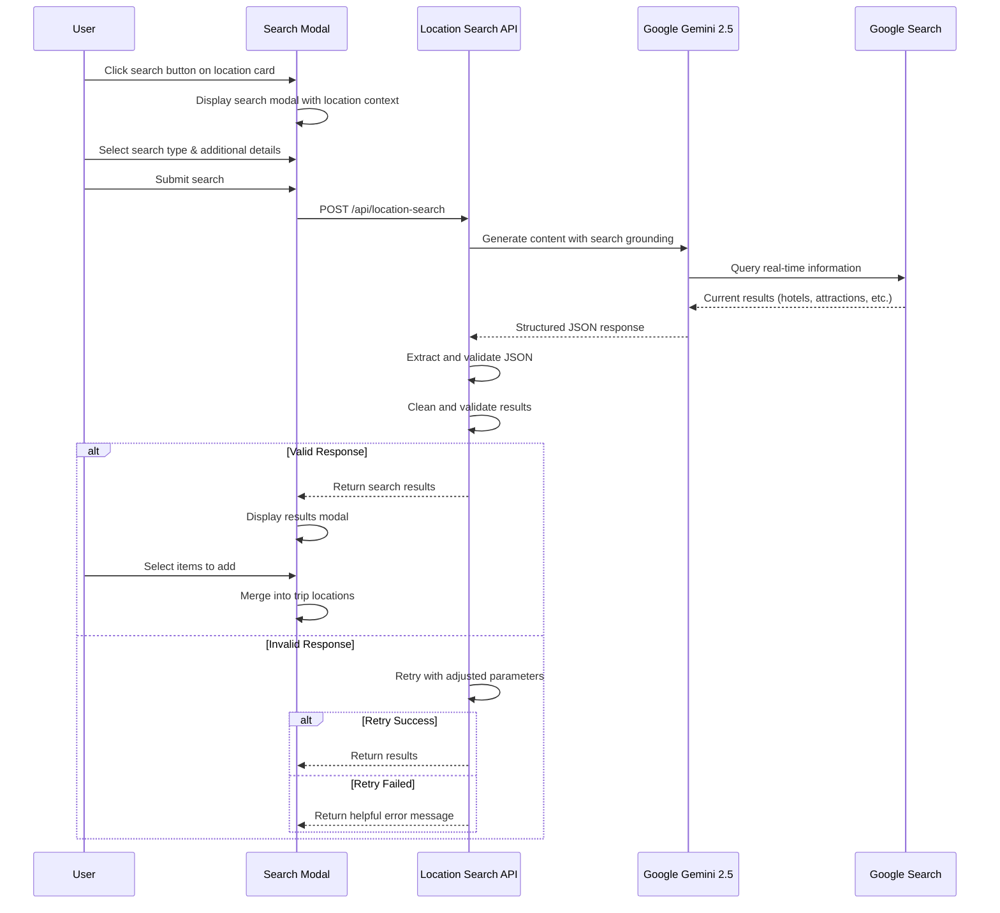
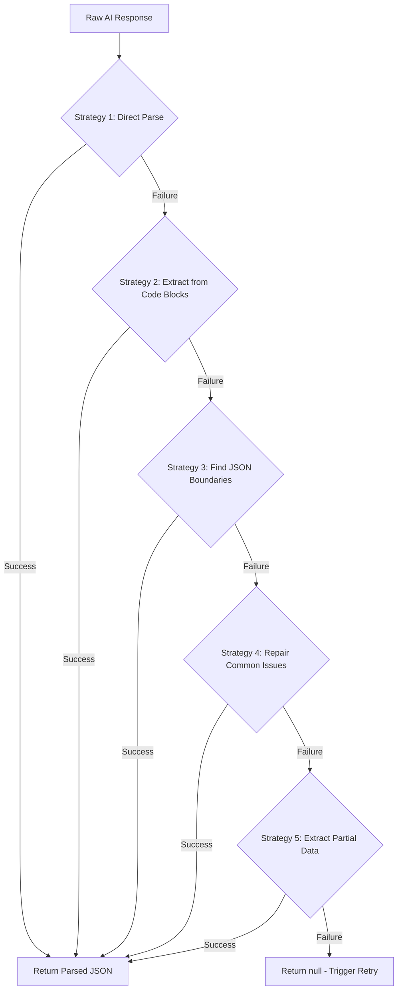
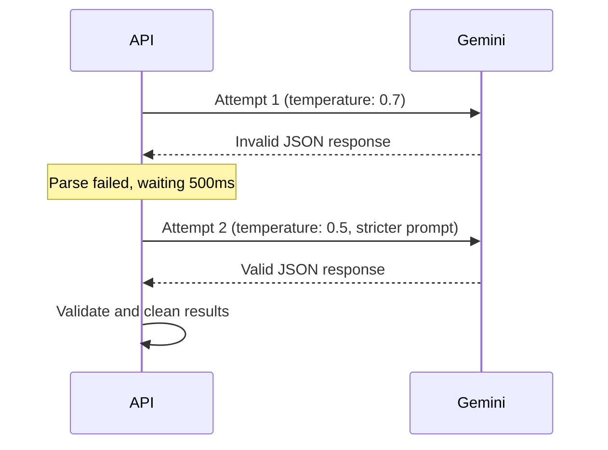

# PlanPilot v1.1: Location Notes & AI-Powered Search Enhancement

**Article Title:** PlanPilot v1.1: Location Notes & AI-Powered Search Enhancement

**Article Excerpt:** Building upon v1.0's foundation, this release introduces personal notes for trip locations and a powerful AI-driven search system that allows users to discover accommodations, attractions, restaurants, and local tips directly within the application—all whilst maintaining robust error handling and a seamless user experience.

**Tags:** PlanPilot, AI Search, Google Gemini, Location Notes, Trip Planning, Serverless API, Error Handling, JSON Validation, Progressive Web App, Travel Tech, Location Search, Modal Interface, Retry Logic, User Experience

---

## Executive Summary

Over the past few days, I've been focused on enhancing PlanPilot's functionality with two significant features: a personal notes system for trip locations and an intelligent AI-powered search capability. These additions transform the application from a trip visualisation tool into a more comprehensive travel planning companion.

The notes feature allows travellers to attach personal observations, reminders, and tips to any location on their itinerary. Meanwhile, the AI search functionality leverages Google Gemini's search grounding capabilities to discover accommodations, attractions, restaurants, and transportation options near any key location—all without leaving the application.

This release comprises 4 commits that introduce new API endpoints, enhanced error handling, and a robust JSON validation system designed to gracefully handle the unpredictable nature of AI-generated responses.

---

## Table of Contents

- [Background & Motivation](#background--motivation)
- [Features Delivered](#features-delivered)
- [Technical Implementation](#technical-implementation)
- [Challenges & Solutions](#challenges--solutions)
- [Insightful Thoughts](#insightful-thoughts)

---

## Background & Motivation

### The Gap in v1.0

Whilst v1.0 delivered a polished trip itinerary interface with drag-and-drop functionality, I noticed a critical gap: once a trip was generated or imported, users had no way to augment locations with their own research or personal notes. The application was excellent at displaying AI-generated content but offered limited tools for personalisation.

Additionally, the initial AI trip generation was a one-shot process. If users wanted more accommodation options or needed to discover nearby restaurants, they had to leave PlanPilot and conduct separate searches elsewhere.

### User Scenarios That Drove This Release

**Scenario 1: The Researcher**
A user generates a trip to Barcelona and receives several hotel recommendations. However, they've read reviews suggesting a boutique hotel not in the results. Currently, there's no way to note this for later comparison.

**Scenario 2: The Spontaneous Explorer**
Whilst reviewing their Paris itinerary, a user remembers hearing about a hidden restaurant near the Louvre. They want to search for dining options without opening a new browser tab and losing their planning context.

**Scenario 3: The Practical Planner**
A user needs to record practical details: "Check-in after 3pm", "Book tickets in advance", "Closed on Mondays". These notes need to persist and be visible in the trip summary.

### The v1.1 Vision

✅ **Location Notes** - Add, edit, and delete personal notes for any location  
✅ **AI-Powered Search** - Search for accommodations, attractions, restaurants, transportation, and tips  
✅ **Custom Queries** - Support for free-form search queries  
✅ **Additional Details** - Specify preferences like "pet-friendly" or "budget under £100"  
✅ **Robust Error Handling** - Graceful recovery from AI response failures

---

## Features Delivered

### 1. Location Notes System

The notes feature provides a dedicated modal for adding personal annotations to any location in the trip.

**Key Capabilities:**

- **Add Notes** - Attach free-form text to any location
- **Edit Notes** - Modify existing notes at any time
- **Delete Notes** - Remove notes when no longer needed
- **Visual Indicators** - Notes icon highlights locations with attached notes
- **Preview Display** - Truncated note preview visible in trip summary cards

**User Interface:**

```
┌─────────────────────────────────────────────────────┐
│ 📝 Location Notes                                   │
├─────────────────────────────────────────────────────┤
│                                                     │
│ Eiffel Tower                                        │
│                                                     │
│ ┌─────────────────────────────────────────────────┐ │
│ │ Your Notes                                      │ │
│ │                                                 │ │
│ │ Book tickets online to skip the queue!         │ │
│ │ Best visited at sunset for photos.             │ │
│ │ Restaurant on 2nd floor has great views.       │ │
│ │                                                 │ │
│ └─────────────────────────────────────────────────┘ │
│                                                     │
│ Notes are saved automatically when you click Save   │
│                                                     │
├─────────────────────────────────────────────────────┤
│ [💾 Save Notes]  [Cancel]  [🗑️ Delete]              │
└─────────────────────────────────────────────────────┘
```

**Integration Points:**

Notes appear throughout the interface:
- In the trip summary card header (truncated preview)
- In marker popups on the map
- In the location details modal
- With visual indicators on nested accommodation/attraction items

### 2. AI-Powered Location Search

The centrepiece of this release—a comprehensive search system that leverages Google Gemini with search grounding to discover relevant information near any key location.

**Search Types Supported:**

| Type | Icon | Description |
|------|------|-------------|
| Accommodations | 🏨 | Hotels, Airbnbs, hostels with real prices and booking links |
| Attractions | ⭐ | Tourist spots, activities, cultural experiences |
| Restaurants | 🍽️ | Dining options with cuisine types and price ranges |
| Transportation | 🚌 | Public transit, car rentals, bike hire options |
| Tips & Advice | 💡 | Local customs, safety tips, best times to visit |
| Custom Search | ✏️ | Free-form queries for specific needs |

**Search Flow:**



**Search Modal Interface:**

```
┌─────────────────────────────────────────────────────┐
│ 🔍 Search Location Info                             │
├─────────────────────────────────────────────────────┤
│                                                     │
│ 📍 Paris, France                                    │
│                                                     │
│ What would you like to find?                        │
│ ┌─────────────────────────────────────────────────┐ │
│ │ 🏨 More Accommodations                        ▼ │ │
│ └─────────────────────────────────────────────────┘ │
│                                                     │
│ Additional Details (Optional)                       │
│ ┌─────────────────────────────────────────────────┐ │
│ │ Pet-friendly, near the Marais district,         │ │
│ │ budget under €150 per night...                  │ │
│ └─────────────────────────────────────────────────┘ │
│ Add any specific preferences or requirements        │
│                                                     │
│ ℹ️ AI will search for current information and       │
│    return real results with prices and links.       │
│                                                     │
├─────────────────────────────────────────────────────┤
│ [🔍 Search]                            [Cancel]     │
└─────────────────────────────────────────────────────┘
```

### 3. Search Results Modal

Search results are displayed in a dedicated modal allowing users to select which items to add to their trip.

**Results Display:**

```
┌─────────────────────────────────────────────────────┐
│ 🔍 🏨 Accommodations                                │
├─────────────────────────────────────────────────────┤
│ Paris, France                     🏨 Accommodations │
│                                                     │
│ ┌─────────────────────────────────────────────────┐ │
│ │ ☑ 🏨 Hotel Le Marais                      View │ │
│ │      Charming boutique hotel in historic...     │ │
│ │      €145/night · 1 night                       │ │
│ ├─────────────────────────────────────────────────┤ │
│ │ ☑ 🏨 Hôtel des Arts Montmartre           View │ │
│ │      Artistic hotel near Sacré-Cœur...         │ │
│ │      €120/night · 1 night                       │ │
│ ├─────────────────────────────────────────────────┤ │
│ │ ☑ 🏨 The Hoxton Paris                     View │ │
│ │      Trendy hotel with industrial design...     │ │
│ │      €180/night · 1 night                       │ │
│ └─────────────────────────────────────────────────┘ │
│                                                     │
│ How would you like to apply these results?          │
│ ┌──────────────────┐  ┌──────────────────┐         │
│ │  ➕ Add to       │  │  🔄 Replace      │         │
│ │     existing     │  │     existing     │         │
│ └──────────────────┘  └──────────────────┘         │
│                                                     │
├─────────────────────────────────────────────────────┤
│ [Apply Selected]                       [Cancel]     │
└─────────────────────────────────────────────────────┘
```

**Merge Options:**

- **Add to Existing** - Appends selected results to current locations
- **Replace Existing** - Removes existing items of the same type near this key location and adds the new selection

### 4. Tips Integration

When searching for local tips, the response is free-form text rather than structured location data. The system automatically offers to save tips as notes:

```
┌─────────────────────────────────────────────────────┐
│ 🔍 💡 Tips & Advice                                 │
├─────────────────────────────────────────────────────┤
│ Barcelona, Spain                    💡 Tips         │
│                                                     │
│ ┌─────────────────────────────────────────────────┐ │
│ │ Best Time to Visit:                             │ │
│ │ Spring (April-June) and autumn (September-      │ │
│ │ November) offer pleasant weather and fewer      │ │
│ │ crowds than peak summer months.                 │ │
│ │                                                 │ │
│ │ Local Customs:                                  │ │
│ │ Lunch is typically served 2-4pm, dinner from   │ │
│ │ 9pm onwards. Many shops close for siesta.       │ │
│ │                                                 │ │
│ │ Money-Saving Tips:                              │ │
│ │ Purchase the Barcelona Card for unlimited      │ │
│ │ public transport and museum discounts...        │ │
│ └─────────────────────────────────────────────────┘ │
│                                                     │
│ ☑ Save these tips as notes for this location       │
│                                                     │
├─────────────────────────────────────────────────────┤
│ [Apply Selected]                       [Cancel]     │
└─────────────────────────────────────────────────────┘
```

---

## Technical Implementation

### System Architecture

The location search feature introduces a new serverless API endpoint whilst leveraging the existing modular frontend architecture:

```mermaid
graph TD
    subgraph Frontend
        A[app.js] --> B[modals.js]
        A --> C[api.js]
        A --> D[trip-summary.js]
        B --> E[Search Modal]
        B --> F[Results Modal]
        B --> G[Notes Modal]
    end
    
    subgraph Backend
        H[/api/location-search.js]
        H --> I[JSON Extraction]
        H --> J[Response Validation]
        H --> K[Link Cleaning]
    end
    
    subgraph External
        L[Google Gemini 2.5]
        M[Google Search]
    end
    
    C --> H
    H --> L
    L --> M
```

### API Endpoint: `/api/location-search`

**Request Schema:**

```javascript
{
  locationName: string,    // "Paris, France"
  lat: number,             // 48.8566
  lng: number,             // 2.3522
  searchType: string,      // "accommodations" | "attractions" | "restaurants" | "transportation" | "tips" | "custom"
  customQuery?: string,    // Required if searchType is "custom"
  additionalDetails?: string, // "Pet-friendly, budget under €100"
  budget?: string          // "budget" | "mid-range" | "luxury"
}
```

**Response Schema:**

```javascript
// For location results (accommodations, attractions, restaurants, transportation)
{
  type: string,
  locationName: string,
  results: [
    {
      id: string,
      type: string,
      name: string,
      description: string,
      price: string,
      link: string,
      lat: number,
      lng: number,
      duration: string
    }
  ]
}

// For tips
{
  type: "tips",
  locationName: string,
  tips: string  // Free-form text
}
```

### JSON Extraction Strategy

One of the most challenging aspects of working with AI-generated content is ensuring valid JSON responses. Despite explicit instructions, language models occasionally return markdown formatting, explanatory text, or malformed JSON.

I implemented a multi-strategy extraction approach:



**Strategy Implementations:**

```javascript
function extractAndParseJSON(responseText, searchType, locationName, lat, lng) {
  let jsonString = responseText.trim();
  
  // Strategy 1: Direct parse
  try {
    return JSON.parse(jsonString);
  } catch (e) { /* Continue */ }
  
  // Strategy 2: Extract from markdown code blocks
  const codeBlockPatterns = [
    /```json\s*\n?([\s\S]*?)\n?```/,
    /```\s*\n?([\s\S]*?)\n?```/,
  ];
  
  for (const pattern of codeBlockPatterns) {
    const match = jsonString.match(pattern);
    if (match) {
      try {
        return JSON.parse(match[1].trim());
      } catch (e) { /* Continue */ }
    }
  }
  
  // Strategy 3: Find JSON object boundaries
  const jsonObjectMatch = jsonString.match(/\{[\s\S]*\}/);
  if (jsonObjectMatch) {
    try {
      return JSON.parse(jsonObjectMatch[0]);
    } catch (e) {
      // Try repair
      const repaired = repairJSON(jsonObjectMatch[0]);
      if (repaired) {
        try { return JSON.parse(repaired); } 
        catch (e2) { /* Continue */ }
      }
    }
  }
  
  // Strategy 4: Extract partial data
  return extractPartialData(text, searchType, locationName);
}
```

### JSON Repair Function

Common AI response issues include trailing commas, unquoted property names, and control characters:

```javascript
function repairJSON(jsonString) {
  let repaired = jsonString;
  
  // Remove text before first { and after last }
  const firstBrace = repaired.indexOf('{');
  if (firstBrace > 0) repaired = repaired.substring(firstBrace);
  
  const lastBrace = repaired.lastIndexOf('}');
  if (lastBrace !== -1) repaired = repaired.substring(0, lastBrace + 1);
  
  // Fix trailing commas
  repaired = repaired.replace(/,\s*([}\]])/g, '$1');
  
  // Fix unquoted property names
  repaired = repaired.replace(/([{,]\s*)([a-zA-Z_][a-zA-Z0-9_]*)\s*:/g, '$1"$2":');
  
  // Fix single quotes to double quotes
  repaired = repaired.replace(/:\s*'([^']*)'/g, ': "$1"');
  
  // Remove control characters
  repaired = repaired.replace(/[\x00-\x1F\x7F]/g, (match) => {
    if (match === '\n') return '\\n';
    if (match === '\r') return '\\r';
    if (match === '\t') return '\\t';
    return '';
  });
  
  return repaired;
}
```

### Retry Logic with Temperature Adjustment

When initial attempts fail, the API retries with adjusted parameters:



**Implementation:**

```javascript
const maxRetries = 2;

for (let attempt = 0; attempt <= maxRetries; attempt++) {
  const requestBody = {
    contents: [{
      parts: [{ 
        text: attempt > 0 
          ? userPrompt + '\n\nIMPORTANT: Response must be ONLY valid JSON.'
          : userPrompt 
      }]
    }],
    generationConfig: {
      temperature: attempt > 0 ? 0.5 : 0.7,  // Lower temperature on retry
      maxOutputTokens: 4096
    },
    tools: [{ google_search: {} }]
  };
  
  // Make request and attempt parsing...
  
  if (attempt < maxRetries) {
    await new Promise(resolve => setTimeout(resolve, 500));
  }
}
```

### Link Validation

To ensure accommodation and attraction links are direct property pages rather than search results, I implemented URL validation:

```javascript
function validateAndCleanResults(data, searchType) {
  if (data.results && Array.isArray(data.results)) {
    data.results = data.results.map((item) => {
      const cleaned = { /* ... copy fields ... */ };
      
      // Validate links - reject search result URLs
      if (item.link && typeof item.link === 'string') {
        const link = item.link.toLowerCase();
        const invalidPatterns = [
          'searchresults', '/s/', 'ss=', '/search/', 
          'hotel-search', 'destination_id='
        ];
        const isInvalid = invalidPatterns.some(p => link.includes(p));
        
        if (!isInvalid && item.link.startsWith('http')) {
          cleaned.link = item.link;
        }
      }
      
      return cleaned;
    });
  }
  
  return data;
}
```

### Frontend Integration

**Modal State Management:**

The modals module maintains state for the notes and search features:

```javascript
// Notes modal state
let currentNotesLocationId = null;
let notesUpdateCallback = null;

// Search modal state
let currentSearchLocationId = null;
let currentSearchLocationName = null;
let currentSearchLocationLat = null;
let currentSearchLocationLng = null;
let searchResultsData = null;
let searchResultsAction = null;  // 'add' or 'replace'
let selectedSearchResults = new Set();
```

**Merge Logic:**

When applying search results, the system intelligently handles both add and replace operations:

```javascript
function mergeLocationResults(newResults, action, keyLocationId) {
  if (action === 'replace') {
    // Find items to remove (same type, nearest to this key location)
    const locationsToRemove = state.locations.filter(loc => {
      if (!resultTypes.includes(loc.type)) return false;
      if (loc.type === 'key-location') return false;
      
      // Check if this is the nearest key location
      const nearestKeyLocId = findNearestKeyLocation(loc);
      return nearestKeyLocId === keyLocationId;
    });
    
    // Remove markers and locations
    locationsToRemove.forEach(loc => {
      map.removeLayer(state.markers[loc.id]);
      delete state.markers[loc.id];
    });
    
    state.locations = state.locations.filter(loc => 
      !locationsToRemove.some(r => r.id === loc.id)
    );
  }
  
  // Add new results with unique IDs
  newResults.forEach((result, index) => {
    const newId = `search-${Date.now()}-${Math.random().toString(36).substr(2, 9)}`;
    const newLocation = {
      id: newId,
      type: result.type,
      name: result.name,
      // ... other fields
    };
    
    state.locations.push(newLocation);
    addMarker(newLocation, state.markers, /* ... */);
  });
  
  // Update UI
  saveCurrentState();
  updateLocationsList(/* ... */);
  updateTripSummary(/* ... */);
}
```

---

## Challenges & Solutions

### Challenge 1: Inconsistent AI JSON Responses

**Problem:** Despite explicit system prompts requesting JSON-only output, Gemini occasionally returned responses with markdown code blocks, explanatory text, or malformed JSON.

**Solution:** Implemented a multi-strategy JSON extraction pipeline with repair capabilities. The system gracefully handles various response formats and only fails after exhausting all parsing strategies.

**Lesson:** When working with AI-generated structured data, assume the worst and build robust parsing. Never trust that the model will follow formatting instructions perfectly.

### Challenge 2: Search Result Link Quality

**Problem:** Initial searches returned Booking.com search result pages rather than direct hotel pages, making the links less useful for users.

**Solution:** Added URL pattern validation that rejects common search result URL patterns and only accepts direct property links.

**Prompt Engineering:**

```
ACCOMMODATION LINKS:
- Valid: "https://www.booking.com/hotel/xx/name.html"
- Valid: "https://www.hotels.com/hoXXXX/"
- INVALID: Any URL with "search", "/s/", "ss="
```

### Challenge 3: Coordinate Type Consistency

**Problem:** The AI sometimes returned coordinates as strings rather than numbers, causing issues with map rendering.

**Solution:** Implemented type coercion in the validation function:

```javascript
if (typeof item.lat === 'number' && !isNaN(item.lat)) {
  cleaned.lat = item.lat;
} else if (typeof item.lat === 'string') {
  const parsed = parseFloat(item.lat);
  if (!isNaN(parsed)) cleaned.lat = parsed;
}
```

### Challenge 4: Notes Modal State Persistence

**Problem:** Opening the notes modal from different entry points (trip summary card, marker popup, nearby item) required maintaining consistent state references.

**Solution:** Created a dedicated state management pattern in the modals module with explicit callback registration:

```javascript
function setNotesModalReferences(locations, saveCallback, updateCallback) {
  notesModalLocations = locations;
  notesModalSaveCallback = saveCallback;
  notesModalUpdateCallback = updateCallback;
}
```

### Challenge 5: Nested Event Handling

**Problem:** The search button on trip summary cards triggered both the search action and the card's click-to-pan behaviour.

**Solution:** Proper event delegation with `stopPropagation()`:

```javascript
const searchBtn = card.querySelector('.trip-summary-card-btn.search');
if (searchBtn) {
  searchBtn.addEventListener('click', (e) => {
    e.stopPropagation();
    window.openLocationSearchModal(loc.id, loc.name, loc.lat, loc.lng);
  });
}
```

---

## Insightful Thoughts

This release has raised several interesting questions that warrant further exploration:

### On AI Response Reliability

**Question:** *How do we build user trust when AI systems occasionally fail or return unexpected results?*

The implementation of retry logic and graceful error handling addresses immediate reliability concerns, but it raises deeper questions about managing user expectations. Should we show users when retries occur? How transparent should we be about the AI's occasional inconsistencies?

### On Search Result Quality

**Question:** *How do we balance comprehensiveness with relevance in AI-generated search results?*

Currently, the system returns 5-8 results per search. Users might prefer more options for accommodations but fewer for niche queries. Should the result count be dynamic based on query type and availability?

### On Notes as a Feature

**Question:** *How might notes evolve from simple text to structured, actionable data?*

Currently, notes are free-form text. Future iterations could parse notes for:
- Dates and times (auto-create reminders)
- Prices (integrate into budget tracking)
- Links (automatic validation and preview)
- Tasks (checkbox-style completion tracking)

### On Search Personalisation

**Question:** *How might we leverage search history to improve future recommendations?*

The system currently treats each search independently. Analysing patterns—users who search for "pet-friendly" accommodations likely want pet-friendly restaurants too—could enhance the experience significantly.

### On Offline Search Capabilities

**Question:** *Can we provide meaningful search functionality without internet connectivity?*

PWA capabilities enable offline access to saved trips, but AI search requires network connectivity. Could we cache previous search results for offline browsing? Pre-fetch likely searches based on itinerary content?

### On the Balance Between AI Generation and Manual Curation

**Question:** *What's the optimal ratio of AI-generated to user-curated content in a trip plan?*

This release explicitly supports both approaches—AI search for discovery, notes for personalisation. Understanding how users blend these capabilities could inform future feature development.

---

## Technical Specifications

### New Files Introduced

| File | Purpose | Lines |
|------|---------|-------|
| `api/location-search.js` | Serverless search endpoint | 546 |

### Modified Files

| File | Changes |
|------|---------|
| `public/js/modals.js` | Added notes and search modal handlers (+400 lines) |
| `public/js/app.js` | Added search result merge logic (+200 lines) |
| `public/js/api.js` | Added `searchLocationInfo` function (+60 lines) |
| `public/js/trip-summary.js` | Added search button to cards (+20 lines) |
| `public/index.html` | Added modal HTML structures (+130 lines) |
| `public/css/components.css` | Added modal and search result styles (+355 lines) |

### API Endpoint Summary

| Endpoint | Method | Purpose |
|----------|--------|---------|
| `/api/location-search` | POST | AI-powered location search with retry logic |

### Search Type Configuration

| Type | Response Format | Max Results | Uses Search Grounding |
|------|-----------------|-------------|----------------------|
| accommodations | Structured JSON | 5-8 | ✅ |
| attractions | Structured JSON | 5-8 | ✅ |
| restaurants | Structured JSON | 5-8 | ✅ |
| transportation | Structured JSON | 5-8 | ✅ |
| tips | Free-form text | N/A | ✅ |
| custom | Structured JSON | 5-8 | ✅ |

---

## Conclusion

This release represents a significant step forward in making PlanPilot a comprehensive trip planning tool. The notes feature addresses a fundamental need for personalisation, whilst the AI-powered search transforms the application from a display tool into an active research assistant.

### Key Achievements

✅ **Location Notes System** - Add, edit, delete personal notes for any location  
✅ **AI-Powered Search** - Six search types with real-time results  
✅ **Additional Details Support** - Specify preferences and requirements  
✅ **Robust JSON Handling** - Multi-strategy parsing with repair capabilities  
✅ **Intelligent Merge Logic** - Add or replace search results contextually  
✅ **Tips Integration** - Save AI-generated tips as location notes

### Lessons Learnt

1. **AI output is never guaranteed** - Build defensive parsing systems
2. **Link quality matters** - Validate URLs to ensure usefulness
3. **State management requires discipline** - Clear ownership prevents bugs
4. **Event handling in nested UIs is tricky** - Consistent `stopPropagation()` usage essential
5. **Error messages should be helpful** - Guide users to next actions, not just report failures

### Looking Forward

With notes and search functionality in place, the foundation is set for more advanced features: budget tracking (leveraging price data from searches), collaborative trip planning (sharing notes between travellers), and offline search caching.

The journey from a trip visualisation tool to a comprehensive planning assistant continues.

---

**Author:** Skilko  
**Date:** 12th January 2026  
**Version:** 1.1  
**Commits:** 4 since v1.0  
**Repository:** [github.com/Skilko/PlanPilot](https://github.com/Skilko/PlanPilot)  
**Live Demo:** [plan-pilot-one.vercel.app](https://plan-pilot-one.vercel.app)

---

*This article documents the v1.1 release of PlanPilot, introducing location notes and AI-powered search capabilities with robust error handling and JSON validation.*

